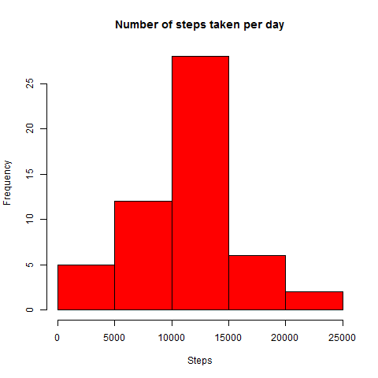
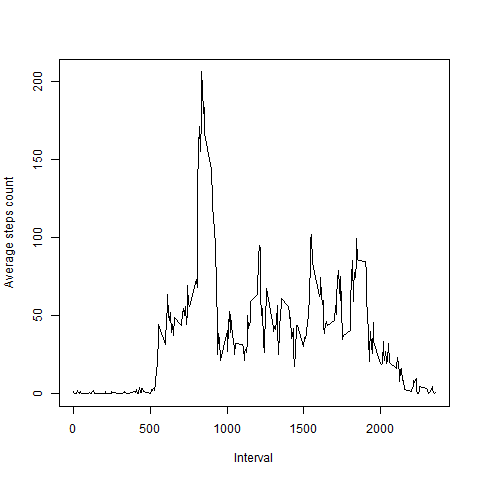
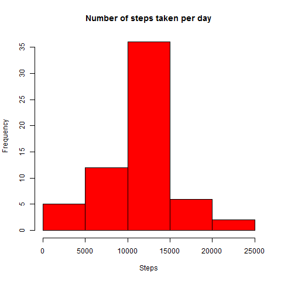
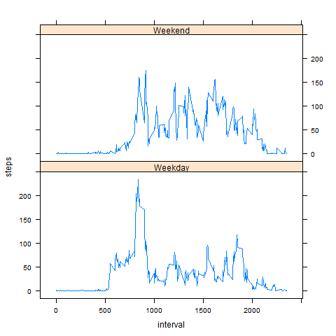

```{r init, include=FALSE, results='hide', echo=FALSE}
library(lattice)
library(ggplot2)
library(sqldf)
library(tcltk2)

```

##Loading and preprocessing the data  
1. Download, unzip the file 
```{r, echo=TRUE}
fileUrl <- "https://d396qusza40orc.cloudfront.net/repdata%2Fdata%2Factivity.zip"
fileName <- "repdata-data-activity.zip"

if(!file.exists(fileName)){
  download.file(fileUrl,fileName, mode = "wb")
}
unzip(fileName)
```
2. Load, re-format and clean the data   
```{r, echo=TRUE}
data <- read.csv("activity.csv", header = TRUE, stringsAsFactors = F,sep = ",")
data$date <- as.Date(data$date, format="%Y-%m-%d")
data$interval <- as.numeric(data$interval)
data$steps <- as.numeric(data$steps)
datanew <- na.omit(data)

```

##What is mean total number of steps taken per day?  
```{r, results='hide'}
stepsperDay <- sqldf("select date, sum(steps) steps from datanew group by date order by date")
png(paste("figure", "StepsPerDayHistOriginal.png", sep = "/"))
hist(stepsperDay$steps, col="red", main = "Number of steps taken per day", xlab = "Steps")
dev.off()
```
 

Mean of the total number of steps taken per day
```{r, echo=TRUE}
m <- mean(stepsperDay$steps)
print(m)
```

Media of the total number of steps taken per day
```{r, echo=TRUE}
me <- median(stepsperDay$steps)
print(me)
```

##What is the average daily activity pattern?
1. Plot a time series of  the average number of steps taken every 5-minute interval
```{r, echo=TRUE, results='hide'}
aveSteps <- sqldf("select interval, avg(steps) steps from datanew group by interval order by interval")
png(paste("figure", "AverageStepCount.png", sep = "/"))
plot(aveSteps$interval, aveSteps$steps, type="l", xlab = "Interval", ylab="Average steps count")
dev.off()
```
 

2. 5-minute interval with the maximum number of steps
```{r, echo=TRUE}
maxSteps <- aveSteps$interval[aveSteps$steps==max(aveSteps$steps)]
print(maxSteps)
```

##Imputing missing values
1. Report total number of missing values in the dataset
```{r, echo=TRUE}
numberNA <- sqldf("select count(*) count from data where steps is null")
print(numberNA)
```
2. Replacing all NA steps values and Update total steps histogram

```{r, echo=TRUE, results='hide'}
dataUpdate <- sqldf(c("update data set steps = (select steps from aveSteps where aveSteps.interval=data.interval) where steps is null", "select * from main.data"))

stepsperDayupdate <- sqldf("select date, sum(steps) steps from dataUpdate group by date order by date")
png(paste("figure","stepsperDayupdate.png", sep = "/"))
hist(stepsperDayupdate$steps, col="red", main = "Number of steps taken per day", xlab = "Steps")
dev.off()

```
 

Update Mean of the total number of steps taken per day
```{r, echo=TRUE}
m2 <- mean(stepsperDayupdate$steps)
print(m2)
```
Update Media of the total number of steps taken per day
```{r, echo=TRUE}
me2 <- median(stepsperDayupdate$steps)
print(me2)
```

##Are there differences in activity patterns between weekdays and weekends?
```{r, echo=TRUE, results='hide'}
datanew$"daytype" <- weekdays(datanew$"date")
dataDaytype <- sqldf(c("update datanew set daytype = 'Weekend' where daytype in ('Saturday','Sunday')", "select * from main.datanew"))
dataDaytype <- sqldf(c("update dataDaytype set daytype = 'Weekday' where daytype in ('Monday','Tuesday','Wednesday','Thursday','Friday')", "select * from main.dataDaytype"))

groupedData <- aggregate(steps ~ interval + daytype, data = dataDaytype, FUN=mean)
png(paste("figure","weekday.png", sep = "/"))
xyplot(steps ~ interval | daytype, data = groupedData, layout=c(1,2), type = "l")
dev.off()
```
 

